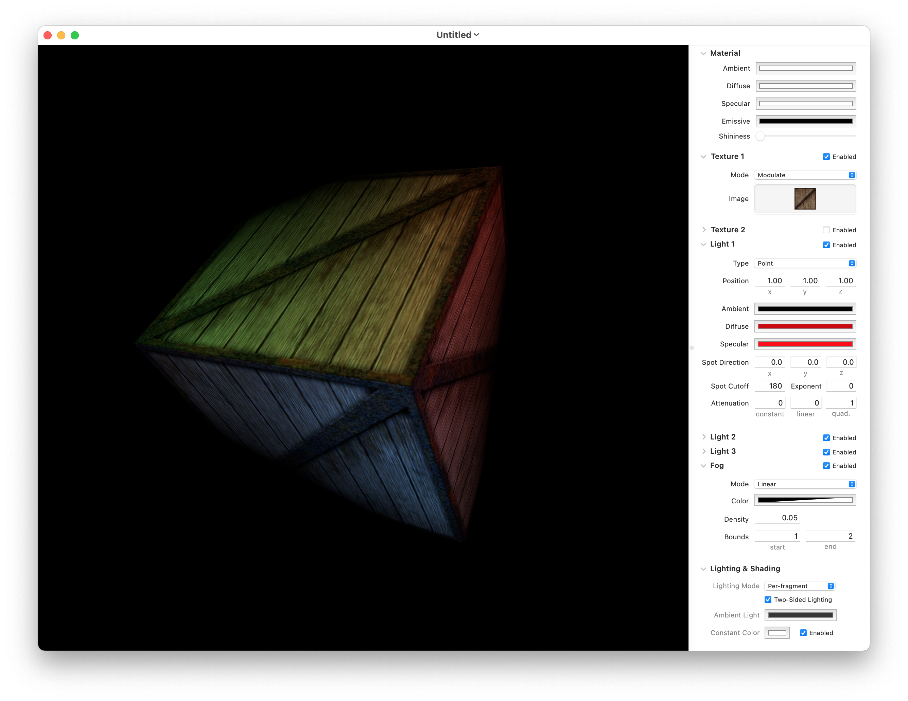

# MBEBaseEffect: Antique Fixed-Function Features for Modern Apps

When [GLKit](https://developer.apple.com/documentation/glkit) was introduced with iOS 5 (2011), it included the [`GLKBaseEffect`](https://developer.apple.com/documentation/glkit/glkbaseeffect) class to allow developers to easily configure lights, materials, fog, and other effects in OpenGL and [OpenGL ES](https://developer.apple.com/documentation/opengles). Shaders were a relatively new feature on the platform (having debuted alongside OpenGL ES 2 in iPhone OS 3 in 2009), and many graphics programmers were not yet up-to-speed on shader programming. `GLKBaseEffect` was a bridge that eased the transition away from fixed-function OpenGL by providing a fixed-function style interface to shaders that implemented portions of the OpenGL ES 1.1 graphics pipeline.

When MetalKit debuted in 2015, it included no such feature. The world had moved well beyond the fixed-function paradigm and fully into the brave new shader-driven world. Developers were now responsible for implementing their own shaders, a task made only more onerous by the rising demand for physically-based rendering.

The `MBEBaseEffect` class in this repository emulates the fixed-function features of `GLKBaseEffect` atop Metal. Whether such a thing even makes sense depends, in part, on how rose-tinted one's nostalgia glasses are. In any event, it's not meant to be taken too seriously. It makes a lot of assumptions, it's quaintly non-physically based, and it's unlikely to be of use in many apps.

Instead, this project is a love letter to the fixed-function pipelines of yore. Simplistic and quaint as they seem now, they were instrumental in bringing a lot of graphics developers into the fold. And if the simplicity of this project is instrumental in illuminating the art of shader programming for any newcomers, that's more than I could ask for.

